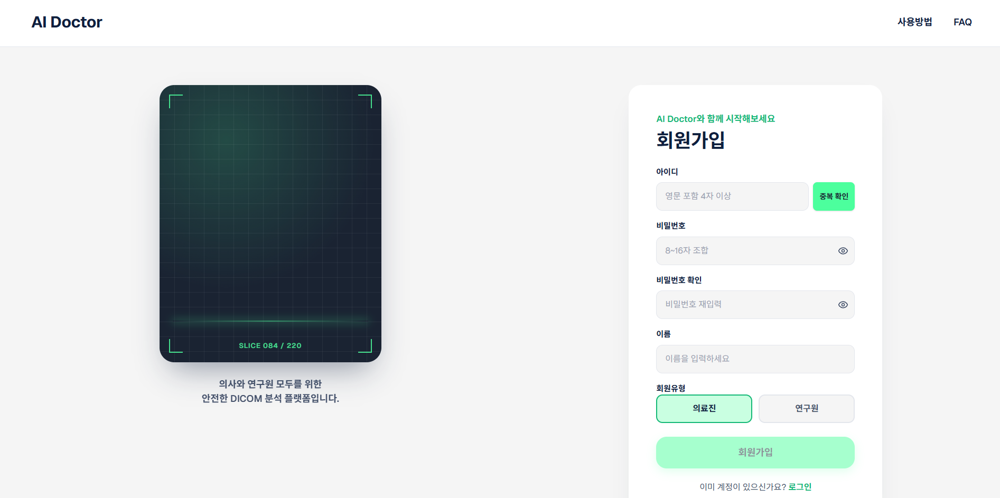
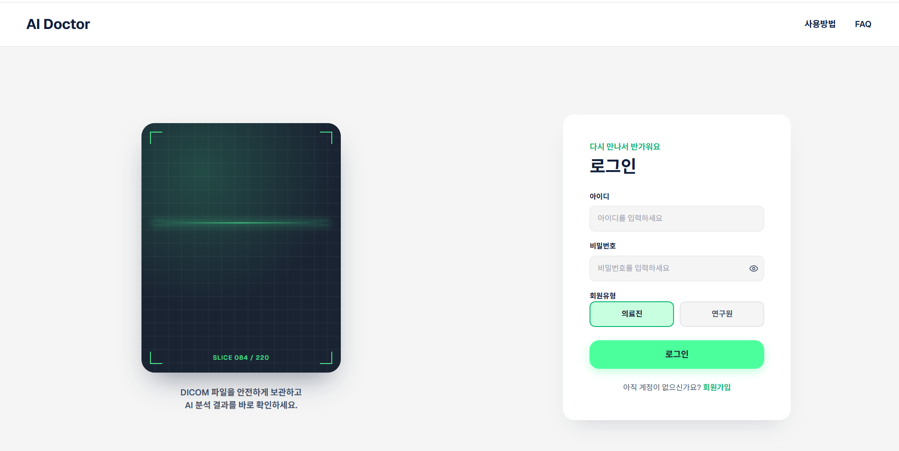
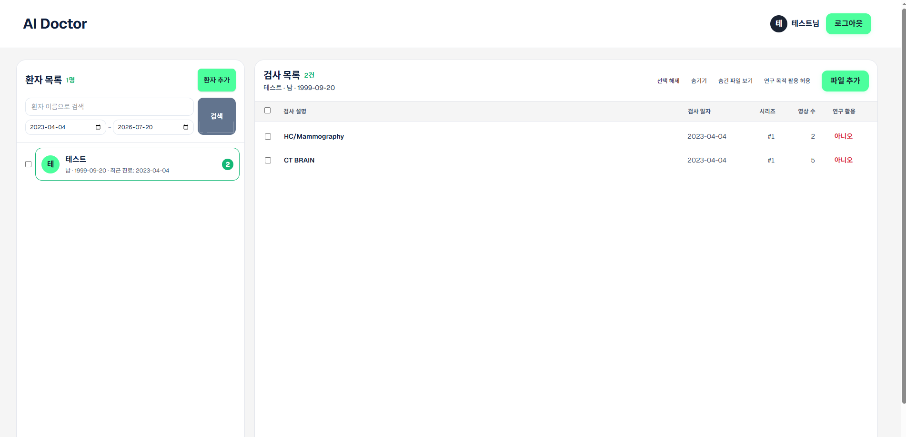
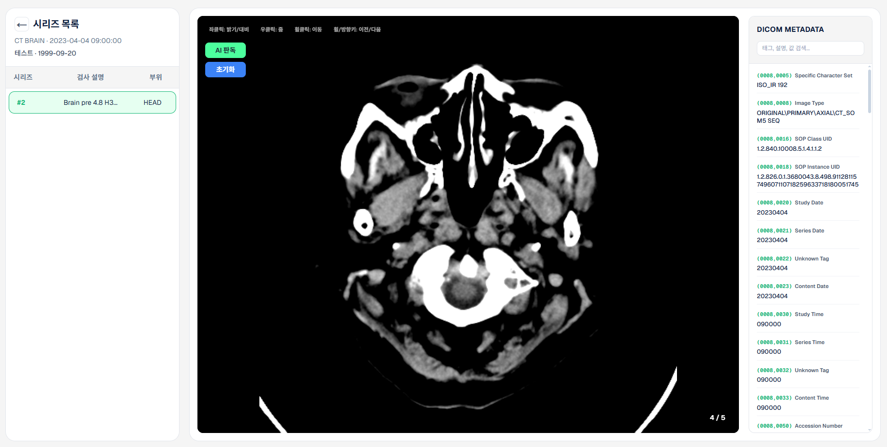

# 프로젝트 명 : AI Doctor
해당 프로젝트는 의료 영상 DICOM 및 AI 보조 파이프라인으로 의료진이 Ai를 활용하여 딥러닝 판독 보조 모델(ONNX/YOLO)활용하여 보다 쉽고 빠르게 진료를 하기 위해 제작된 프로젝트입니다.
의료용 메인 서비스와 연구원용 익명화 서비스를 분리 운영하여, 진료 데이터와 연구용 데이터(익명화 처리) 반출을 안전하게 격리합니다.


## 주요기능
- **웹 DICOM 뷰어**: Cornerstone.js 기반 의료영상 실시간 렌더링, 마우스 드래그 윈도잉(WL/WW), 다중 프레임(cine) 지원
- **환자/검사 관리**: 환자 – 검사(Study) – 시리즈(Series) 계층 조회(인스턴스는 Orthanc 실시간 조회), 조건별 필터링, 숨김 처리, ZIP 다운로드(단건/일괄)
- **AI 병변 탐지**: 픽셀 데이터 수신 → HU 변환 → ONNX Runtime(YOLOv8) 추론 → Bounding Box 오버레이 시각화. Modality/촬영 부위 기반으로 모델을 자동 선택해 알맞은 검사에만 적용
- **익명화 파이프라인**: 연구 목적 활용 허용 시 PS3.15 기반 개인정보 비식별화 및 UID 재매핑 후 연구용 백엔드로 자동 전달
- **보안/감사**: JWT(httpOnly 쿠키) 인증, Redis 토큰 블랙리스트, 민감 정보 조회 시 감사 로그 기록


| 질환 |    모달리티    |           모델            |
|:-:|:----------:|:-----------------------:|
|뇌종양|  CT / MR   |        best.onnx        |
|폐렴|CR(흉부 X-ray)|CR_pneumonia_yolov8n.onnx|


## 기술 스택

| 구분 | 기술 |
| --- | --- |
| 프론트 | Next.js 16 / React 19, TypeScript 5, Tailwind CSS 4, Cornerstone.js (DICOM 뷰어) |
| 백엔드 | Spring Boot 3.5 / Java 21, dcm4che 5.31, JWT |
| AI | ONNX Runtime, YOLOv8 |
| 인프라 | Orthanc PACS (DICOM 실물), MySQL 8.0 (메타데이터), Redis (토큰 블랙리스트), Docker Compose |


## 실행 화면

### 회원가입


### 로그인


### 메인 화면


### 진찰 화면



 ## 시스템 파이프라인 흐름도
```
┌─────────────────────────┐      ┌──────────────────────────────┐

│ dicom-back (8080)       │ ───▶ │ back-anonymization (8081)    │

│ 의료진용 메인 백엔드        │ 콜백  │ 연구원용 익명화 백엔드          │

│ Spring Boot + ONNX      │      │ 별도 MySQL/Redis/Orthanc      │

└──────┬──────────┬───────┘      └──────────────────────────────┘
       ↓          ↓

    Orthanc     MySQL

```
## 핵심 설계 원칙

- **색인·실물 분리**: 무거운 DICOM 바이트는 Orthanc, 메타데이터는 MySQL에 저장
- **소프트 삭제**: 물리 삭제 대신 hidden_flag 플래그 제어 (법정 보존 의무)
- **가명화**: 연구 반출 시 DICOM PS3.15 준수 마스킹 및 UID 재매핑
- **Java ONNX 런타임**: 파이썬 없이 자바 백엔드에서 전처리(HU 변환)와 추론 수행
- **감사 로그**: JWT 인증 + 민감 정보 접근 행위 로그 영속화 (AOP)


### dicom-back (8080)
| 메서드 | 경로 | 설명                        |
| --- | --- |---------------------------|
| POST | /users/login · /signup · /logout | 의사 인증 (JWT httpOnly 쿠키사용) |
| GET | /dicom/patients · /studies · /series | 환자/검사/시리즈 목록 조회           |
| POST | /dicom/upload | DICOM 다중 업로드 (부분 성공 허용)   |
| GET | /dicom/studies/download · /series/download | ZIP 다운로드                  |
| POST | /dicom/download/batch | 다중 선택 일괄 ZIP 다운로드         |
| POST | /dicom/studies/research-allow | 연구 활용 허용 + 익명화 처리         |
| GET | /dicom/series/{key}/instances/{id}/file | 뷰어용 DICOM 스트리밍            |
| POST | /ai/detect-raw | AI 병변 탐지                  |

### back-anonymization (8081)
| 메서드 | 경로 | 설명 |
| --- | --- | --- |
| POST | /users/login · /signup | 연구원 인증 |
| GET | /dicom/studies · /series | 익명화된 연구용 데이터 조회 |
| GET | /dicom/studies/download | 연구용 ZIP 다운로드 |
| POST | /dicom/get-anonymization | 익명화 완료 서비스 간 내부 콜백 |


## 시작하기
```
# 1. Orthanc PACS 및 인프라 활성화 (의료용 8042 / 연구용 8043)
docker compose up -d

# 2. 백엔드 실행 (dicom-back: 8080 / back-anonymization: 8081)
./gradlew bootRun

# 3. 프론트엔드 실행
npm install && npm run dev
```

## 프로젝트 주소
[AI Doctor 주소 : https://dicom.nkdev.shop/](https://dicom.nkdev.shop/)


